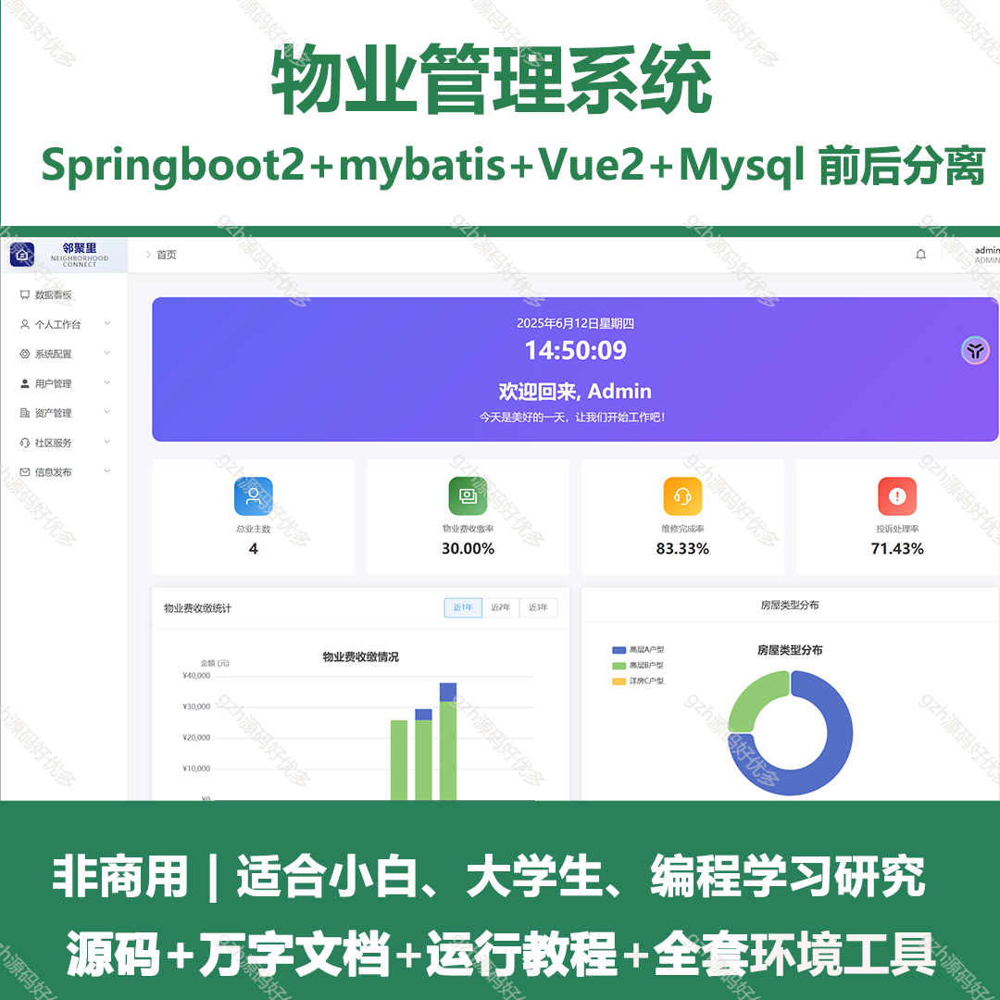
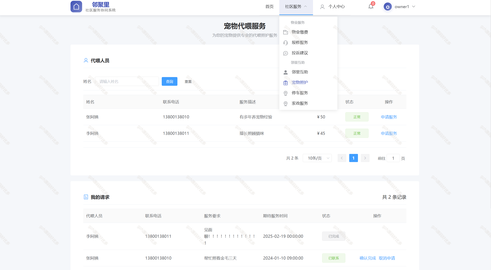
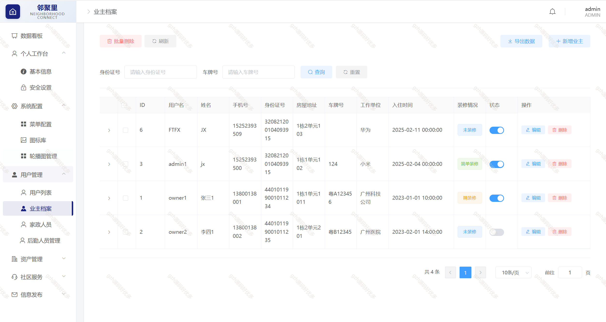
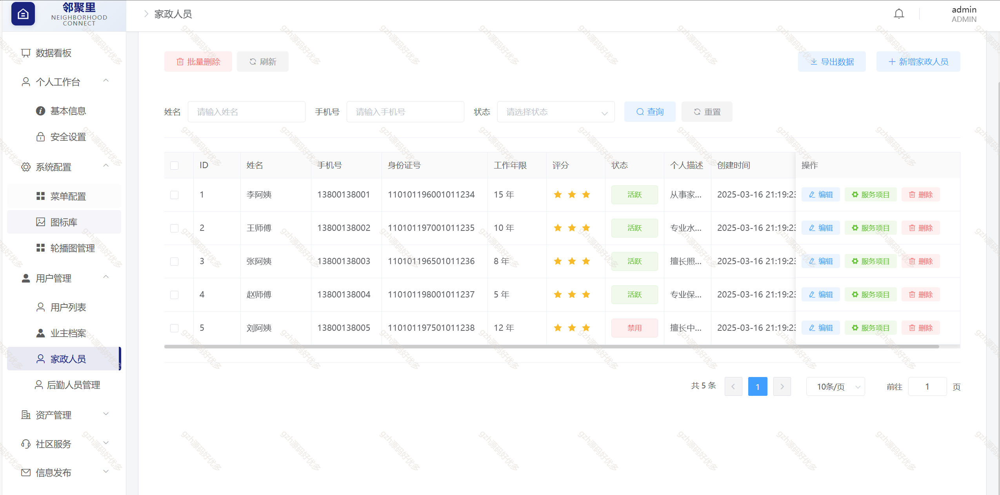
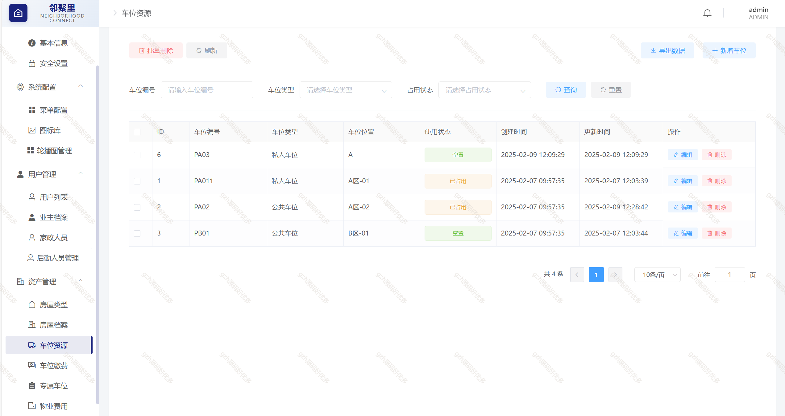
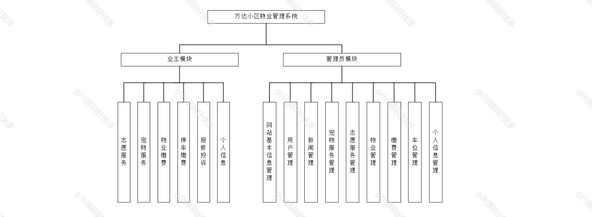

# springbootA379
springbootA379物业管理系统
 
## 查看主页获取源码

### 一、关键词

物业管理系统、物业系统

 

### 二、作品包含

源码+数据库+万字文档+全套环境和工具资源+部署教程

 

### 三、项目技术

前端技术： vue2 Element Plus Axios Echarts
后端技术：Java、SpringBoot2.0、MyBatis

  

 

### 四、运行环境（以下版本亲测，其他版本未知，请自测）

开发工具：IDEA/eclipse  + VSCODE

数据库：MySQL8

数据库管理工具：Navicat10以上版本

环境配置软件： JDK17 + Maven3.6.3

前端Nodejs：16

浏览器：谷歌浏览器

 

### 五、项目介绍

项目编号：springbootA379

随着智慧社区建设的快速发展，传统物业管理模式已难以满足现代小区多元化服务需求。本文基于Java Web技术，结合Spring Boot框架与MySQL数据库，设计并实现了一套功能完备的物业管理系统。系统采用模块化设计，围绕用户角色与业务场景，划分了业主用户、管理员及后勤人员三类角色，并通过九大核心功能模块实现业务流程全覆盖。

1. 系统角色划分
1.1 业主用户
普通业主：系统的主要使用者，可以使用基础服务功能
- 可进行物业费缴纳
- 可提交维修申请
- 可参与志愿活动
- 可发布宠物代喂需求

车位业主：拥有停车位的业主，可以使用停车相关功能
- 包含普通业主所有权限
- 可进行车位费用管理
- 可查看车位使用状态

1.2 管理员
超级管理员：系统最高权限，可以管理其他管理员
- 管理员账号的添加/编辑/删除
- 系统参数配置
- 所有数据的操作权限

普通管理员：处理日常物业事务
- 业主信息管理
- 费用管理
- 维修派单
- 投诉处理
- 内容发布

1.3 后勤人员
维修人员：处理业主报修事项
- 接收维修任务
- 更新维修进度
- 完成维修确认

志愿者：提供志愿服务
- 查看志愿活动
- 报名参与活动
- 记录服务时长

 

### 六、运行截图

